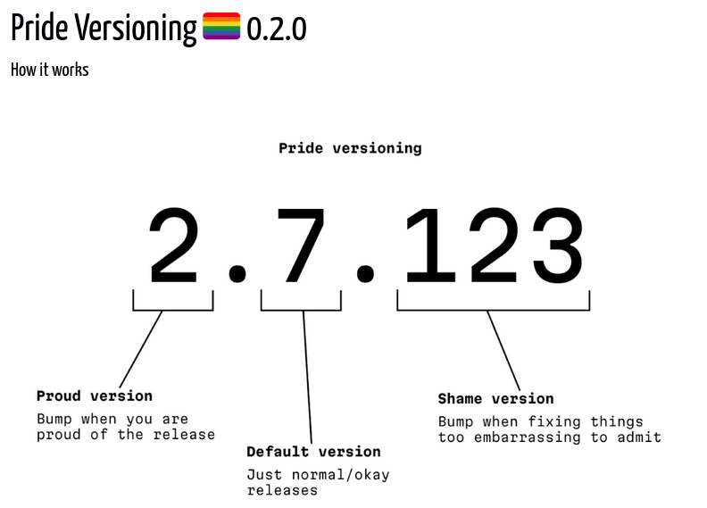

+++
title = "Better HTTP API versioning with VX Versioning"
date = "2025-02-13T18:13:00.308Z"
+++

Inspired by Anthony Fu's [Epoch Semantic Versioning](https://antfu.me/posts/epoch-semver), this is my take on another versioning headache.


## Preface: The social contract of the major version

[Semantic versioning](https://semver.org/) is a simple way of describing change to a project. Semantic versions follow a simple grammar: `{MAJOR}.{MINOR}.{PATCH}`. A project could describe a version as `1.0.2` or `v2.11.0-rc2`, and both are equally valid. It's intuative to everyone that bigger numbers are newer, but it's not always intuative when you should change a number.





An [Application Programming Interface](https://en.wikipedia.org/wiki/API) (API) is how our software can use other software. If the API was to change, it's possible our software may stop working.

The [Semantic Versioning 2.0.0 specification](https://semver.org/) provides some excellent guidance.


## VX Versioning

VX versioning has one rule:

> If an API may break, use an `x`.

That's it.

VX is an abreviation for "Version eXperimental". It's something I started doing back in 2016


```html
api.twitch.tv/kraken/...
api.twitch.tv/helix/... - no guarentee 
```
